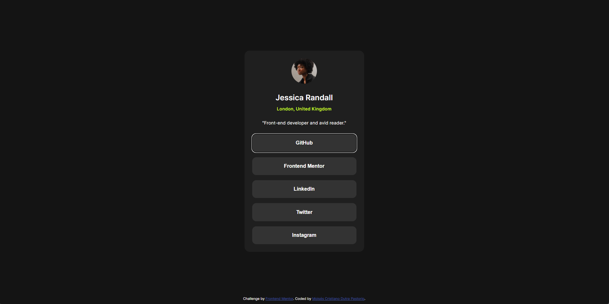

# Frontend Mentor - Social links profile solution

This is a solution to the [Social links profile challenge on Frontend Mentor](https://www.frontendmentor.io/challenges/social-links-profile-UG32l9m6dQ). Frontend Mentor challenges help you improve your coding skills by building realistic projects. 

## Table of contents

- [Overview](#overview)
  - [Screenshot](#screenshot)
  - [Links](#links)
- [Meu processo](#my-process)
  - [Feito com](#built-with)
  - [O que aprendi?](#what-i-learned)
  - [Desenvolvimento contínuo](#continued-development)
  - [Recursos úteis](#useful-resources)
- [Autor](#author)

## Overview

### Screenshot

### Links

- URL do Repositório da Solução: [GitHub](https://github.com/moiz4rt/social-links-profile-main)
- URL do Site com a Solução: [Netlify](https://solutiontosociallinksprofilemain.netlify.app/)

## Meu processo

Eu tentei centralizar o card usando _position: absolute_ por causa das vantagens de não ser necessário maximizar o contêiner pai pra poder colocar na posição desejada. Mas com isso deslocava-se o rodapé do crédito e se perdia as vantagens do _display: flex_ que incluem a centralização dos elementos nos dois eixos com _justify-content_ e _align-items_ e o gap, o que seria muito trabalhoso utilizando outra forma.
Em alguns casos onde precisei diminuir a margem inferior tive que mudar o _line-height_ para evitar margens negativas.
Ainda tenho uma certa insegurança em definir uma largura fixa em um contêiner por medo de quebrar o layout. Mas o layout fica muito esticado em tamanhos maiores. A solução foi usar o _max-width_.
É muito extenuante calcular proporções no olho, mas pelo menos o resultado final parece ter chegado mais perto.
Ia usar _html { font-size: 62.5% }_, mas li que era melhor manter em 100% e utilizar variáveis. Como este é um desafio pequeno não me importei em escrever variáveis, mas com certeza teria usado se fosse um projeto bem maior.

### Feito com 

- HTML5 
- CSS 
  - Flexbox
- Abordagem Mobile-first 

### O que aprendi? 

Tirando dúvidas com o ChatGPT descobri que meu HTML não está nada acessível para deficientes visuais. Faltou um main, trocar a div final por um footer, usar arialabels, navs, e também o alt nas imagens.

### Desenvolvimento contínuo 

Acho que o meu maior problema neste projeto foi o problema da acessibilidade. Vou começar a focar mais nessa parte.

### Recursos Úteis 

- [Live Server do Vscode](https://marketplace.visualstudio.com/items?itemName=ritwickdey.LiveServer)  - É uma maravilha não ter que ficar recarregando a página a cada pequena interação.

## Autor 

- Frontend Mentor - [@moiz4rt](https://www.frontendmentor.io/profile/moiz4rt)